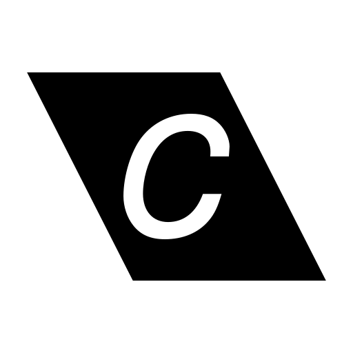

  

    
    
    
    

---
- [About](#about)
- [Getting Started](#getting-started)
  - [Prerequisites](#prerequisites)
- [Built Using](#built-using)
- [Authors](#authors)
- [Acknowledgements](#acknowledgements)

## About

## Getting Started

### Prerequisites

## Built Using

## Authors

View the list of [contributors](https://github.com/corium-engine/corium/contributors) who participated in this project.

## Acknowledgements

